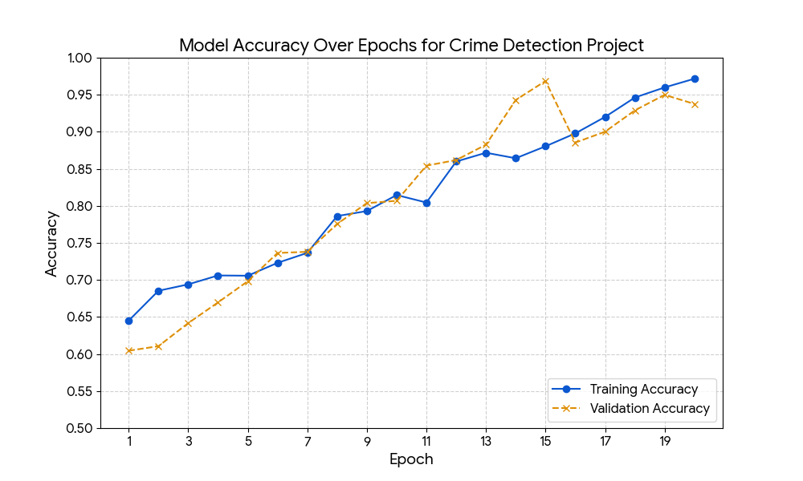
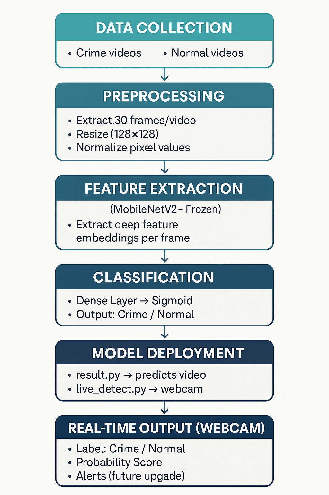

=======
# 🔍 Surveil-AI — Real-Time Crime Detection System

<p align="center">
  
  
  
  
  
</p>

> A deep learning–powered surveillance system that detects violent or suspicious activity from live webcam feeds and pre-recorded videos — in real time.

---

## 📌 Overview

**Surveil-AI** is an end-to-end video intelligence system built with a hybrid **CNN + LSTM** architecture. It classifies video sequences as **Crime** or **Normal** by learning spatial features per frame (via MobileNetV2) and temporal patterns across frames (via LSTM). The system supports both live webcam inference and offline video prediction, making it a scalable foundation for smart surveillance applications.

---

## 🧠 Model Architecture

```
Input (30 frames × 128×128×3)
        │
        ▼
TimeDistributed(MobileNetV2)   ← Frozen pretrained CNN (ImageNet)
        │
        ▼
TimeDistributed(GlobalAveragePooling2D)
        │
        ▼
LSTM(64 units)
        │
        ▼
Dropout(0.3)
        │
        ▼
Dense(32, ReLU) → Dense(1, Sigmoid)
        │
        ▼
Output: Crime / Normal
```

---

## 🗂️ Project Structure

```
Surveil-AI/
├── dataset/
│   ├── crime/          # Crime video clips
│   └── normal/         # Normal activity video clips
├── models/
│   └── crime_detection_model.keras
├── train.py            # Model training script
├── result.py           # Offline video prediction
├── live_detect.py      # Real-time webcam inference
├── requirements.txt
└── README.md
```

---

## ⚙️ Setup & Installation

### 1. Clone the repository

```bash
git clone https://github.com/your-username/Surveil-AI.git
cd Surveil-AI
```

### 2. Create a virtual environment (recommended)

```bash
python -m venv venv
source venv/bin/activate        # Linux / macOS
venv\Scripts\activate           # Windows
```

### 3. Install dependencies

```bash
pip install -r requirements.txt
```

---

## 📁 Dataset Structure

Place your videos in the `dataset/` folder following this structure:

```
dataset/
├── crime/
│   ├── video1.mp4
│   ├── video2.mp4
│   └── ...
└── normal/
    ├── video1.mp4
    ├── video2.mp4
    └── ...
```

> Each video should be at least **30 frames** long. The model samples 30 evenly spaced frames per video.

---

## 🏋️ Training

```bash
python train.py
```

The trained model will be saved to `models/crime_detection_model.keras`.

**Training configuration (editable in `train.py`):**

| Parameter    | Default |
|--------------|---------|
| Frame Count  | 30      |
| Image Size   | 128×128 |
| Batch Size   | 4       |
| Epochs       | 10      |
| Optimizer    | Adam    |
| Loss         | Binary Crossentropy |

---

## 🎬 Inference

### Predict on a Video File

Edit the path in `result.py` and run:

```bash
python result.py
```

**Output:**
```
Prediction: CRIME (0.87)
# or
Prediction: NORMAL (0.12)
```

### Live Webcam Detection

```bash
python live_detect.py
```

- The system collects **30 frames** before making its first prediction
- Labels are overlaid live on the webcam feed
- Press **`Q`** to quit

---

## 📊 Model Performance

The model was trained for **20 epochs** and achieved strong convergence:

| Metric              | Value  |
|---------------------|--------|
| Final Train Accuracy | ~97%  |
| Final Val Accuracy   | ~94%  |



---

## 🔄 System Flowchart



---

## 🛠️ Tech Stack

| Component         | Technology                  |
|-------------------|-----------------------------|
| Language          | Python 3.9+                 |
| Deep Learning     | TensorFlow 2.12 / Keras     |
| Computer Vision   | OpenCV                      |
| CNN Backbone      | MobileNetV2 (Transfer Learning) |
| Sequence Model    | LSTM                        |
| Data Processing   | NumPy, Scikit-learn         |
| Visualization     | Matplotlib                  |
| Version Control   | Git & GitHub                |

---

## 💡 Motivation

Growing up, I often watched news coverage of crimes where investigators
spent days manually reviewing hours of CCTV footage just to identify
a suspect or reconstruct an incident. It always struck me — we have
cameras everywhere, yet the process of actually *using* that footage
is painfully slow and entirely manual.

That thought stuck with me: **why can't the camera itself tell you
when something is wrong?**

As a CS student, when I got the opportunity to build a final year
project, I knew exactly what I wanted to solve. Instead of humans
watching screens for hours, what if an AI could flag suspicious
activity the moment it happens — in real time?

That idea became **Surveil-AI**. Built solo as a college project,
it was my attempt at making surveillance smarter, faster, and more
proactive — so that by the time something critical happens, the
system has already raised the alarm.

## 🚀 Future Improvements

- [ ] Multi-class crime classification (robbery, assault, vandalism, etc.)
- [ ] Email / SMS alert integration on crime detection
- [ ] CCTV / RTSP stream support
- [ ] Web dashboard for monitoring multiple camera feeds
- [ ] EfficientNet / BiLSTM / GRU model variants
- [ ] Model quantization for edge deployment

---

## 📄 License

This project is licensed under the [MIT License](https://github.com/Pratiksingh07-dy/Surveil-AI/blob/main/LICENSE).

---

## 🙋 Author

**Your Name**
- GitHub: [@Pratiksingh07-dy](https://github.com/Pratiksingh07-dy)
- LinkedIn: [Pratiksingh2005](https://www.linkedin.com/in/pratiksingh2005/)

---

> ⭐ If you found this project useful, please consider giving it a star!
>>>>>>> Stashed changes
